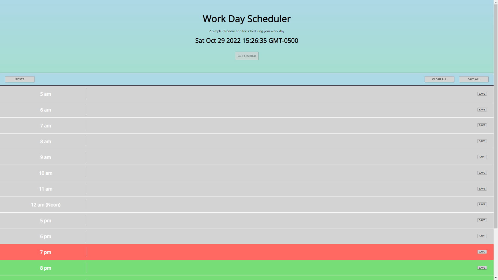

# scheduler
A simple schedule web application designed to help a user log and track their daily schedule.  

The interface features rows for most hours of the day and night and input boxes for the user to type directly into.  

The application can save the user's input, and display the same input even after refreshing.  

Has a clear-all, save-all and reset feature for convenience.  

